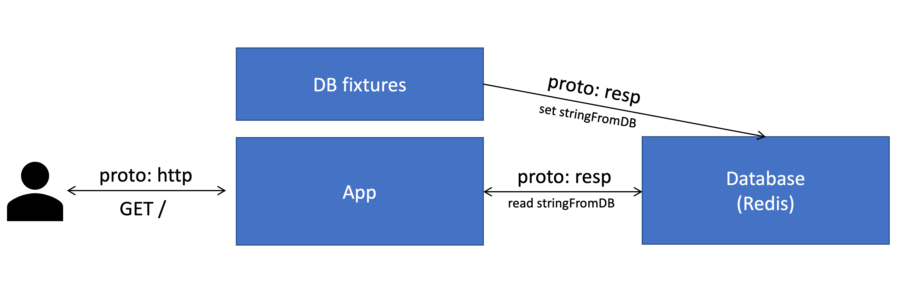
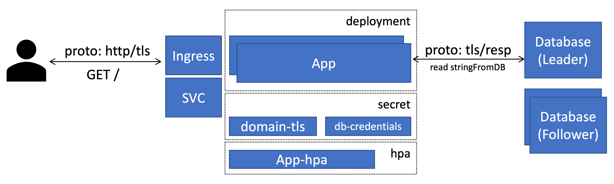

# hello-world-from-db-app

## Design



### Considerations

- App reads stringFromDB only once during the init and then utilizes the value for all resources.
- By default, DB (Redis) returns empty values for stringFromDB.

## Development

### Prerequisites

- docker docker-compose

### Run tests

- _TBA_

### Run application locally

- app> `docker-compose up`

### Load DB fixtures

- `docker-compose exec app etc/load_fixtures.sh`

## Deployment

### Prerequisites

- minukube with ingress, metrics-server addons
- helm and kubernetes-cli

- Execute runner.sh, specifying STAGE as an environment variable. `dev` and `prod` supported.

  #### dev

  - Run `STAGE=dev ./runner.sh`

  #### prod

  - Consider and apply resources that manage separately. See production specifics.
  - Run `STAGE=prod ./runner.sh`

### Configuration

- controlled under `deployment/values_${STAGE}.yaml` respectively.

### Run chart tests

- `helm test hello-world-from-db-${STAGE}`

### Production specifics



- [SECURITY] App exposed with HTTP/TLS. TLS resources manage separately.
  ```
  # Generate test PKI https://stackoverflow.com/a/60516812/5860684
  kubectl create secret tls prod-hello-world-from-db-tls --key test_key.key --cert test_cert.cert
  ```
- [SCALABILITY] App autoscaled with HPA, see `autoscaling` and resources (CPU/Mem) defined.

  ```
  NAME                       REFERENCE                             TARGETS    MINPODS   MAXPODS   REPLICAS   AGE
  hello-world-from-db-prod   Deployment/hello-world-from-db-prod   226%/80%   1         2         2          6m8s
  ```

- [LOGGING] App runs in production (NODE_ENV), which could be used for app logging and tracing modes.

- [SECURITY] Database password from secret. Secrets creation manages separately.

  ```bash
  # Simplified way of secret creation
  kubectl create secret generic db-credentials  --from-literal="dbPassword=supersecret" --namespace hello-world-from-db-prod
  ```

- [CI/CD] Database fixture load manages separately. For `dev`, automated with init_container.

  ```bash
  # Simplified way of fixture loading
  export POD_NAME=$(kubectl get pods --namespace hello-world-from-db-prod -l "app.kubernetes.io/name=hello-world-from-db,app.kubernetes.io/instance=hello-world-from-db-prod" -o jsonpath="{.items[0].metadata.name}")
  kubectl exec $POD_NAME --namespace hello-world-from-db-prod -- etc/load_fixtures.sh

  # reload app (see design considerations)
  export DEPLOYMENT_NAME=$(kubectl get deploy --namespace hello-world-from-db-prod -l "app.kubernetes.io/name=hello-world-from-db,app.kubernetes.io/instance=hello-world-from-db-prod" -o jsonpath="{.items[0].metadata.name}")
  kubectl rollout restart deployment/${DEPLOYMENT_NAME} --namespace hello-world-from-db-prod
  ```

- [SCALABILITY] Database deployed in [cluster mode](https://redis.io/presentation/Redis_Cluster.pdf). See `redis.cluster`.

  _TODO: Utilize cluster capabilities in the App._

- [SECURITY] TODO: App <-> Database with [mTLS](https://redis.io/topics/encryption).

- [SECURITY] TODO: App <-> Database with [ACL](https://redis.io/topics/acl)
